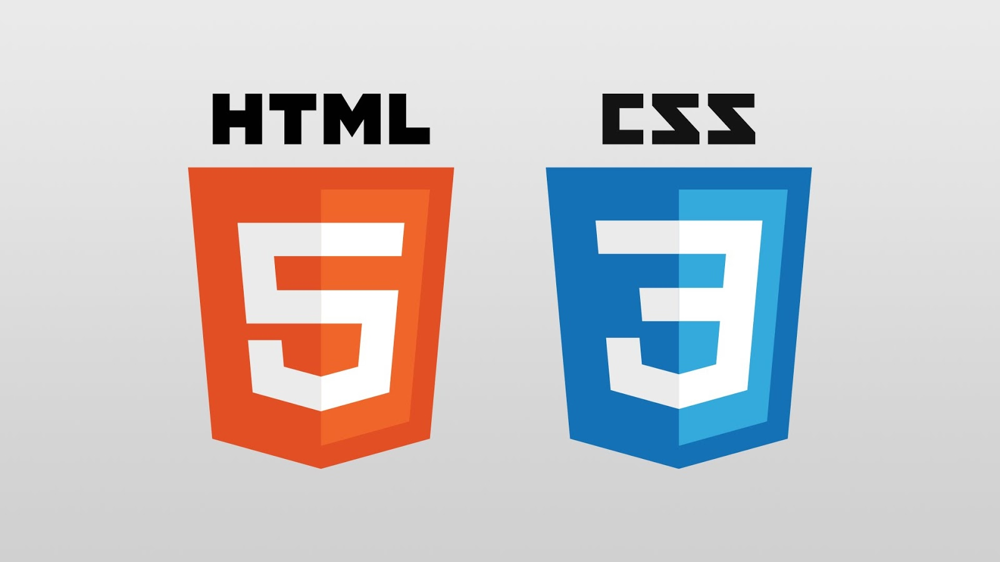
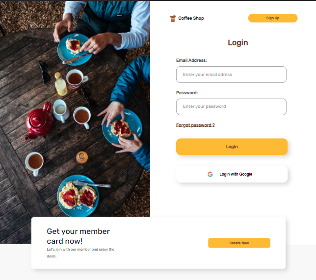
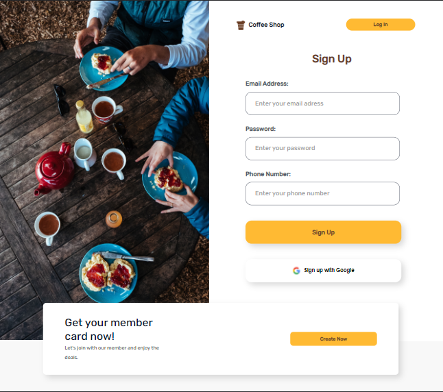
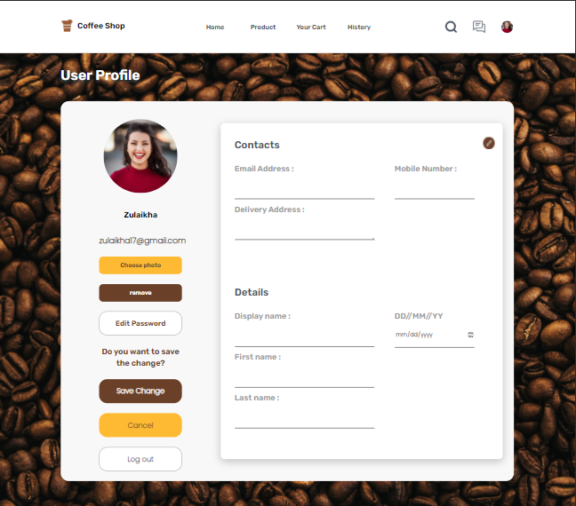
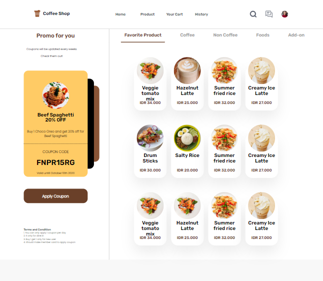

<h1 style="text-align:center">Starbills Coffee Shop HTML and CSS</h1>

<div style="display:flex; justify-content:center; ">
    
</div>

# Introduction
<div style="display:flex; flex-direction:row">


</div>

<h2>How to Install</h2>

1. Clone the repository
    ```
    https://github.com/billhikmah/CoffeeShop-Frontend-HTML-CSS
    ```
2. Open the file using [VSCode](https://code.visualstudio.com/download)

<h2>Deploy</h2>

1. [Home](https://thestarbills.netlify.app/)
2. [Product](https://thestarbills.netlify.app/product)
3. [Login](https://thestarbills.netlify.app/login)
4. [Sign Up](https://thestarbills.netlify.app/signup)
5. [Profile](https://thestarbills.netlify.app/profile)
6. [Forgot Password](https://thestarbills.netlify.app/forgot)
7. [History](https://thestarbills.netlify.app/history)
8. [Payment](https://thestarbills.netlify.app/payment)
9. [Product Details](https://thestarbills.netlify.app/product-details)

<h2>Preview</h2>
<h3>Login & Sign Up</h3>

<div style="display:flex; justify-content: left; column-gap:20px; margin-bottom:20px">




</div>

<div style="display:flex; justify-content: left; column-gap:20px; margin-bottom:20px">




</div>

<h2>Related Documentation</h2>

1. Server (Backend)<br>
    Server documentation can be accessed via [Postman](https://documenter.getpostman.com/view/20723287/UyrEguSx). The backend has been deployed to Heroku and the assets have been uploaded to the cloud in the cloudinary.

2. Client (Frontend)<br>
    The client side has been documented with React.js framework and deployed on [Netlify](https://starbills.netlify.app/).
